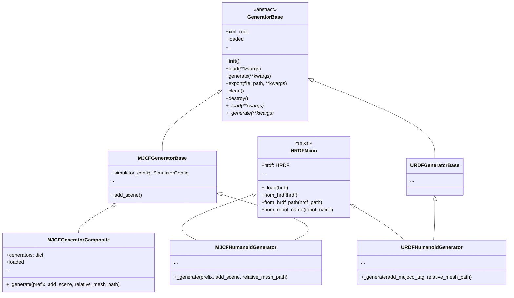

## Generator类

所有的Generator类都应该是基类`GeneratorBase`的子类。

一个Generator类在其生命周期之内主要有三个行为：
- 构造（`__init__()`）：通过外部参数构造实例，不涉及到任何数据加载
- 加载（`load()`）：将外部数据（通常保存在HURODES_ASSETS_PATH路径下）加载进Generator类，由各个子类完成加载和校验逻辑
- 生成（`generate()`）：目前Generator类只支持生成xml文件（mjcf和urdf都是xml文件），`generate`函数用于根据已经加载的信息在`xml_root`上生成元素

对于加载（`load`）和生成（`generate`），分别有一个用于重置的行为：
- 清理（`clean()`）：删除加载阶段加载的外部数据
- 销毁（`destroy()`）：重置`xml_root`，清除生成阶段产生的结果

Generator类及其子类的类图如下：



在Generator基类中，我们实现了`export()`函数，他要求实例已经完成了加载，可以一步到位生成最终的xml字符串并保存到指定路径。

> 此外，尽管HRDF和Generator都是hurodes的重要组成部分，但是两者的逻辑并没有完全绑定，这是因为其他库（如humanoid-retargeting）也会使用Generator，而其并不依赖HRDF。我们通过HRDFMixin以代码补丁的形式将Generator和HRDF结合。

### 加载

基类`GeneratorBase`实现了`load(**kwargs)`函数，通常情况下子类只需要实现`_load(**kwargs)`，其中传入的参数`**kwargs`完全由`_load`处理。

Generator类有一个名为`_loaded`的属性，其通过`@propert`函数`loaded`被访问，用于表示当前的实例是否已经加载了数据。当外部调用`load()`函数时，基类会自动将`_loaded`设置为`True`。调用`generate`和`export`函数时，其都会断言`loaded`的值为`True`。

在某些特殊情况下可能需要重写`loaded`的逻辑，例如在`MJCFGeneratorComposite`中`loaded`会检测所有持有的Generator是否已经被加载，如果都被加载了则返回`True`。

在实际使用中，可以先构造Generator类，再调用`load()`函数加载数据，例如:
```
generator = MJCFHumanoidGenerator()
generator.load(hrdf)
```

也可以实现`from_*`类方法，在构造的时候就完成加载:
```
generator = MJCFHumanoidGenerator.from_hrdf(hrdf)
```

运行`clean`函数可以清除加载阶段产生的所有结果，同时自动执行`destroy`函数销毁生成的结果，用于使Generator回到刚被构造的状态。

### 生成

同样的，基类`GeneratorBase`实现了`generate(**kwargs)`函数，通常情况下子类只需要实现`_generate(**kwargs)`，其中传入的参数`**kwargs`完全由`_generate`处理。

通常情况下Generator类只需要将调用`load()`所加载的数据添加到`xml_root`即可。一些特殊情况，如`MJCFGeneratorComposite`，则会依次调用所有持有的Generator。

运行`destroy`函数可以销毁生成阶段产生的所有结果，但不会影响load阶段加载的数据。理论上，应该满足销毁后再次生成的结果与之前一致:

```
generator.load()
str1 = generator.export(**kwargs)
generator.destroy()
str2 = generator.export(**kwargs) # same args
assert str1 == str2
```

## MJCFGenerator

所有MJCFGenerator都有以下特性：
- simulator_config：`MJCFGeneratorBase`类及其子类都会持有`simulator_config`，用于设定与仿真引擎相关的信息。在`MJCFHumanoidGenerator`类中，`simulator_config`会被从HRDF中读取
- 不使用`<defualt>`：为了简化MJCFGenerator及其子类的逻辑，我们不在MJCF中使用`<defualt>`标签，这一定程度上降低了其生成的MJCF的可读性，但极大简化了Generator的生成逻辑。注意：我们同样不鼓励在正常情况下维护和分发MJCF（你只应该维护和分发HRDF，MJCF则在被使用的时候自动导出）

### prefix和scene

prefix和scene是MJCFGenerator相对于其他Generator类的主要差别。他们都可以在调用`generate()`函数的时候被指定是否启用，例如`MJCFHumanoidGenerator`类的`_generate`函数签名为`_generate(self, prefix=None, add_scene=True)`。

其中prefix可以用来设定生成的`xml`文件的每一个名称(`name`，如`body_name`，`joint_name`，`mesh_name`等等)的前缀。其作用是防止当多个generator通过`MJCFGeneratorComposite`合并时由于名字重复而报错。这在retargeting以及多机器人交互的场景中非常实用。

注意：prefix只在generate的时候被使用，他不应该对HRDF本身产生任何更改。

scene则与mujoco的特性有关，`MJCFGeneratorBase`实现了`add_scene()`函数，用于根据传入的数据（通常是`simulator_config`中的数据）以及默认值生成仿真器中的场景信息，子类可以在`_generate()`中选择是否调用`add_scene()`函数以生成场景。

### MJCFGeneratorComposite

`MJCFGeneratorComposite`用于将多个MJCFGenerator生成的结果合并，从而在同一个仿真引擎中实现多个机器人的交互。其主要有以下特性：
- 不实现加载函数：`MJCFGeneratorComposite`要求传入的generator在外部完成加载，可以是在传入时已经加载好，也可以在传入后在外部加载。其`load`函数只会检测所有持有的generator是否已经加载，不会执行加载逻辑
- 自动合并所有顶级Element：顶级Element指的是在`<mujoco>`标签直接拥有的Element，常见的有`<compiler>`，`<asset>`，`<worldbody>`，`<actuator>`和`<visual>`等
- 合并mesh地址：自动寻找所有generator的mesh文件地址，计算所有mesh地址的公共路径，并修改每个mesh的相对路径

## URDFGenerator

与MJCF不同，URDF是一个更加通用的机器人描述格式，被广泛应用于ROS生态系统中。`URDFGeneratorBase`提供了URDF格式的基础功能。

### URDFHumanoidGenerator

`URDFHumanoidGenerator`是用于生成人形机器人URDF描述文件的生成器。其主要特性包括：

- **链接（Link）生成**：根据HRDF中的body信息生成URDF的link元素，包括惯性信息、碰撞几何体和视觉几何体
- **关节（Joint）生成**：根据HRDF中的joint信息生成URDF的joint元素，包括关节类型、轴向、限位等信息
- **MuJoCo标签支持**：通过`add_mujoco_tag`参数，可以在URDF中添加MuJoCo特定的标签，使得URDF可以被MuJoCo加载和使用

### MJCF vs URDF：XML结构差异

MJCF和URDF在XML组织方式上有本质区别，这直接影响了Generator的实现逻辑：

**MJCF采用层次结构（Hierarchical）：**

```xml
<mujoco>
  <worldbody>
    <body name="torso">
      <joint name="free"/>
      <geom/>
      <body name="left_leg">
        <joint name="hip"/>
        <geom/>
        <body name="left_foot">
          ...
        </body>
      </body>
    </body>
  </worldbody>
</mujoco>
```

body元素嵌套在父body内部，形成树状结构。因此`MJCFHumanoidGenerator`使用`recursive_generate_body()`递归遍历父子关系：

```
    def recursive_generate_body(self, parent=None, current_index=-1, prefix=None):
        ...

        for child_index, parent_idx in enumerate(self.body_parent_id):
            if parent_idx == current_index:
                body_elem = self.generate_single_body_xml(parent, child_index, prefix=prefix)
                self.recursive_generate_body(body_elem, child_index, prefix=prefix)
```

**URDF采用平铺结构（Flat）：**

```xml
<robot>
  <link name="torso">...</link>
  <link name="left_leg">...</link>
  <link name="left_foot">...</link>
  
  <joint name="hip" type="revolute">
    <parent link="torso"/>
    <child link="left_leg"/>
  </joint>
  <joint name="ankle" type="revolute">
    <parent link="left_leg"/>
    <child link="left_foot"/>
  </joint>
</robot>
```

所有link和joint平铺在robot根元素下，通过joint的`<parent>`和`<child>`标签引用link名称建立关系。因此`URDFHumanoidGenerator`分别遍历生成：

```
    def _generate_links(self, add_mujoco_tag=False) -> dict:
        ...
        for body_info in body_info_list:
            link_elem = ET.SubElement(self.xml_root, "link")
            ...
```

```
    def _generate_joints(self, add_mujoco_tag=False) -> dict:
        ...
        for joint_info in joint_info_list:
            joint_elem = ET.SubElement(self.xml_root, "joint")
            ...
            # Add child body info to joint
            child_body_info = self.get_info_by_attr("name", body_name, "body", single=True)
            child_body_info.to_urdf_elem(joint_elem, "child")

            # Add parent body info to joint
            parent_body_id = self.body_parent_id[child_body_info["id"].data]
            parent_body_info = self.get_info_by_attr("id", parent_body_id, "body", single=True)
            parent_body_info.to_urdf_elem(joint_elem, "parent")
```

这种结构差异也导致了合成逻辑的不同：MJCF可以通过`MJCFGeneratorComposite`轻松合并多个机器人（因为可以直接将多个body树放在同一个worldbody下），而URDF由于是平铺结构，合并时需要处理可能的link/joint名称冲突。

